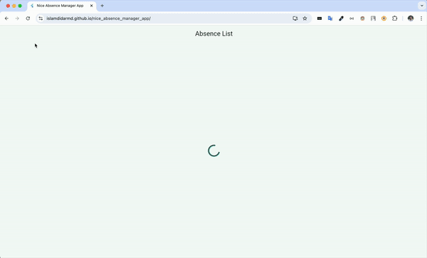

# Table of Contents

<!-- TOC -->

* [🚀 Nice Absence Manager App - Flutter](#-nice-absence-manager-app---flutter)
    * [Features](#features)
    * [Demo](#demo)
    * [Project Overview](#project-overview)
        * [Used Technologies](#used-technologies)
        * [Third party dependencies](#third-party-dependencies)
        * [Codebase Architecture](#codebase-architecture)
        * [Folder Structure](#folder-structure)
        * [Code Linting](#code-linting)
    * [Improvement scope](#improvement-scope)
    * [How to Run](#how-to-run)

<!-- TOC -->

# 🚀 Nice Absence Manager App - Flutter

This app displays the list of absences with information of employees.

## Features

- ✅ List of absences including the names of the employees
- ✅ Pagination on scroll down with 10 items per page
- ✅ Total number of absences
- ✅ For each absence below information displayed:
    - ✅ Member name
    - ✅ Type of absence
    - ✅ Period
    - ✅ Member note (when available)
    - ✅ Status (can be 'Requested', 'Confirmed' or 'Rejected')
    - ✅ Admitter note (when available)
- ✅ Filter absences by type.
- ✅ Filter absences by date.
- ✅ Loading state displayed until the list is available.
- ✅ An error state is displayed if the list is unavailable.
- ✅ An empty state is displayed if there are no results.
- ✅ (Bonus) Can generate an iCal(.ics) file and import it into outlook by Tapping on list item (Android and iOS only)
- ✅ Deployed to Github pages
- ✅ Adaptive UI (Small, Medium and Large)
- ✅ BLoC State Management

## Demo

| Android                                   | iOS                                   |
|-------------------------------------------|---------------------------------------|
|  |  |

| Web                                   |
|---------------------------------------|
|  |

Flutter Web demo can also be accessed
at: [Nice Absence Manager App Web](https://islamdidarmd.github.io/nice_absence_manager_app/)

## Project Overview

### Used Technologies

- Flutter
- Tests: flutter_test library
- Code Linter (Very good analysis)
- Flutter BLoC.

### Third party dependencies

- `cached_network_image`
- `dart_mappable`
- `flutter_bloc`
- `get_it`
- `injectable`
- `intl`
- `path_provider`
- `share_plus`
- `flutter_gen_runner`
- `mockito`
- `very_good_analysis`

### Codebase Architecture

This codebase uses a **Layered Architecture** with feature folders. The
**UI**, **Business Logic** and **Data** Layers are separated.

This architecture can be further customized depending on the
project needs. If we want to make it `clean code architecture`,
need to introduce a **Domain** layer that sits between **UI** and **Data**
as a **Contract**.

We can also move **feature** folders to their separate package depending on
the needs and the team size.

### Folder Structure

- `root`
    - `android`: contains android specific code
    - `ios`: contains ios platform specific code
    - `web`: contains web specific code
    - `lib`: contains the dart code
        - `core`: this directory contains the core files for this project
        - `di`: configuration files for Dependency injection
        - `feature`: contains features of this project
            - `absences`: absence feature container
                - `ui`: contains the UI layer
                - `data`: contains the data layer for this feature
        - `gen`: generated typed file for assets
        - `main.dart`: the entrypoint for this Flutter project

### Code Linting

Used `very_good_analysis` package for linter rules with my own customization that are
available in `analysis_options.yaml` file.

## Improvement scope

- **Pagination**: The pagination api call is simulated in the repository. This is not ideal scenario.
  For simulating this I'm loading mock json from assets and when BLoC layers calls
  for paginated data, I'm parsing the json and returning data for the requested page.
  In ideal scenario, this logic will be handled by backend and repository will only prepare
  the response after api returns.
- **UI**: The UI is kept very basic thinking of the time constraints. Loading, empty and error states
  are very minimal and for pagination not displaying any indicator that new data is loading. In ideal case,
  These UI should improve
- **Calendar event**: For event generation, I'm generating .ics file manually and that only supports Android and iOS.
  Web support can be added later
- **Theme**: I'm using default minimal theming that can be improved
- **Filter**: At this moment, Selected filters can not be reset. This feature should be added to provide better UX
- **Adaptive UI**: I did a very basic adaptive UI implementation. This should be taken into account and
  should be implemented to provide better UI/UX
- **Testing**: There is not much test coverage for this codebase. I only added unit tests for repository
  and the BLoC. In ideal cases I would like to add widget tests along with integration tests for
  making sure the components are working correctly
- **Deployment**: For deploying to Github Pages, I created a script `deplpyment.sh`. This script can also be improved
- **CI/CD**: CI/CD not integrated. For example, in Github, it would be nice have `Github Actions` setup for
  running tests automatically and to also perform automatic deployments

## How to Run

### Prerequisites

* **Java Development Kit (JDK):** Ensure you have JDK 17 or later installed.
* **Flutter SDK:** Ensure you have Flutter SDK version 3.24.5 or later installed.
* **IDE:** You can use Android Studio, Visual Studio Code, or any other IDE that supports Flutter development.
* **Device or Emulator:** An Android or iOS device, or an emulator running Android or iOS. You can also select Google
  Chrome as a target for running the app.

### Steps to Run

- Clone this repository

```shell
  git clone https://github.com/islamdidarmd/nice_absence_manager_app.git
```

- Download dependencies

```shell
  flutter pub get
```

- Run `flutter run` or use `IDE` to select a device to run

```shell
  flutter run
```
